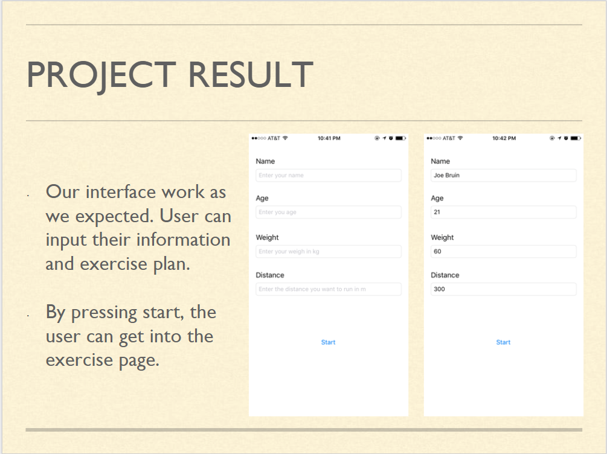
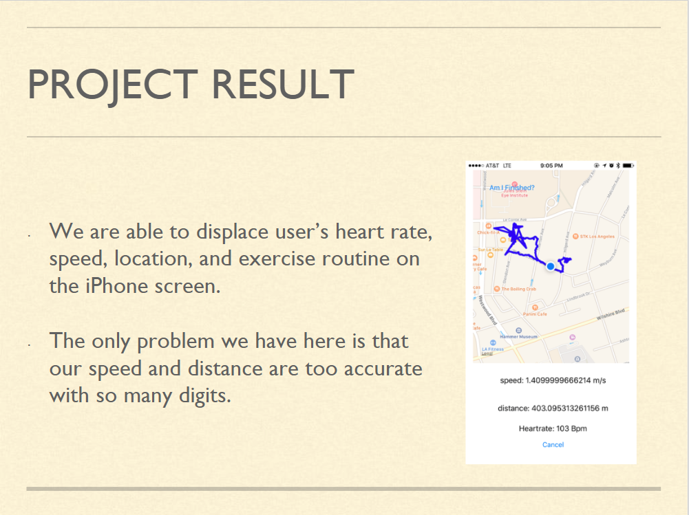
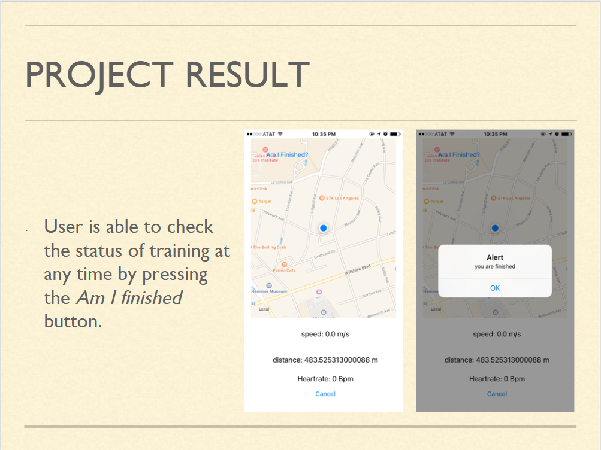

# Fitness-Assistor

Fitness assistor is an iOS application based on Google Map and implemented with H7 Heart Rate Sensor. 

This application can measure the real-time heart rate, location and routes of users while they are jogging. 

By using this application, users can better control their workout routine.

In our Fitness assistor, we mainly use Bluetooth technology. 

The reason for our choice of Bluetooth over other wireless technologies is that H7 Heart Rate Sensor uses Bluetooth 

to communicate with outside devices. 

The core of our project is using H7 Heart Rate Sensor to gather a user’s heart rates and sending these information back

via Bluetooth connection. 

On top of that, we need to be able to utilize Apple’s Map functionality in order to obtain our user’s current location, 

his/her speed and distance he/she travels. 

Finally, we want to design a friendly user interface so that  we can combine the previous two parts and create the application on 

IOS known as Fitness assistor.

